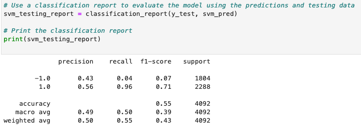
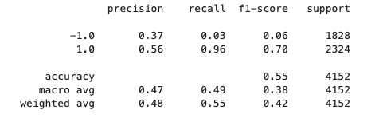
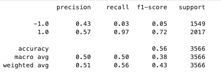
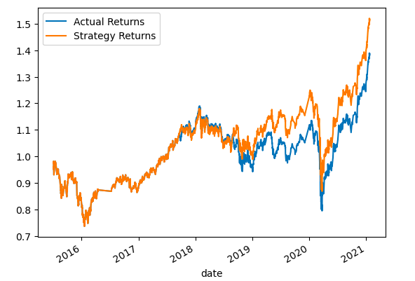
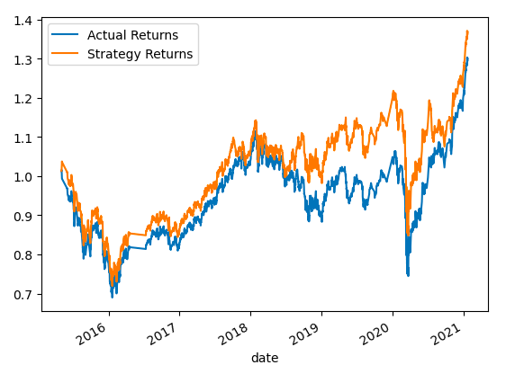
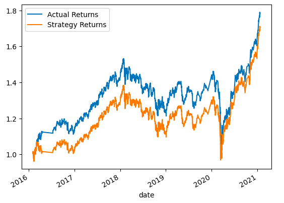
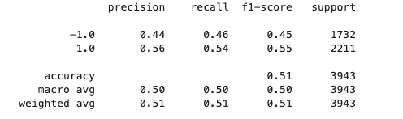
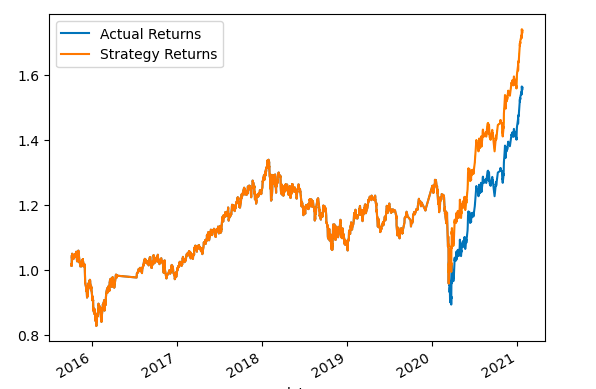

# Machine Learning Trading Bot

## Background

In this notebook,we’ll assume the role of a financial advisor at one of the top five financial advisory firms in the world. Our firm constantly competes with the other major firms to manage and automatically trade assets in a highly dynamic environment. In recent years, firm has heavily profited by using computer algorithms that can buy and sell faster than human traders.

The speed of these transactions gave our firm a competitive advantage early on. But, people still need to specifically program these systems, which limits their ability to adapt to new data. we’re thus planning to improve the existing algorithmic trading systems and maintain the firm’s competitive advantage in the market. To do so, you’ll enhance the existing trading signals with machine learning algorithms that can adapt to new data.

We’ll combine your algorithmic trading skills with financial Python programming and machine learning to create an algorithmic trading bot that learns and adapts to new data and evolving markets.

We will also create a report that compares the performance of the machine learning models based on the trading predictions that each makes and the resulting cumulative strategy returns.

## Table of Contents
* [Code & Resource File](#code-&-resource-file)
* [Instruction](#python-variables)
* [Evaluation Report](#evaluation-report)

## Code & Resource File

* [Analysis Notebook](machine_leraning_trading_bot.ipynb)
* [Resources](Resources/emerging_markets_ohlcv.csv)
> **Note:** The provided CSV file contains OHLCV data for an MSCI&ndash;based emerging markets ETF that [iShares](https://www.ishares.com/us/products/268704/ishares-currency-hedged-msci-emerging-markets) issued. Investments in emerging markets make up an important aspect of a well-diversified investment portfolio. This is because the included equities have potentially higher long-term returns, even though they carry more risk.

## Instructions

The steps for this analysis are divided into the following sections:

* Establish a Baseline Performance

* Tune the Baseline Trading Algorithm

* Evaluate a New Machine Learning Classifier and check
> *Did our new model perform better or worse than the provided baseline model? 
> *Did our new model perform better or worse than your tuned trading algorithm?

* Create an Evaluation Report

## Evaluation Report

As part of your GitHub repository’s README.md file, you will also create a report that compares the performance of the machine learning models based on the trading predictions that each makes and the resulting cumulative strategy returns.
#### With SVM classifier 

Here we experimented on trainin window, with SMA fast window = 4 and SMA slow = 100, to find the best performing training time for the model. 
**_Observation:** when training window is increased from 3 months to 10 months we observed a slight increase of 1% in accuracy, 1% increase for +1 signal in precision recall and 1% decrease for -1 signal whereas upon decreaseing the training window by 1 month there is a slight decrease of 2% in accuracy, no change in recall values but decrease in precision for -1 signal.
However we see maximum strategy returns(of 38.7%) with 3 months training window then compared to 10 or 1 months
> Another observation, when we increased both of the SMA windows-> slow window= 48(from 4) and fast window-> 101(from 100) with training period same as 3 months, strategy returns traced actual returns initially then ended greater than actual return after march 2020. Also recall for signal = 1 reached 100% from 96%

#### With AdaBoost Classifier

**Conclusion:** Accuracy wise we can see that our models achieved around 50% but when it comes to returns, maximum performance for both SVM and AdaBoost classifiers was observed with 6 months training window, as our strategy returns reach maximum 73.57 where actual retrns are 56.04
Hence the best model performance happened at training time of 6 months SMA windows: slow = 48 , fast = 101. 
Both models performance was observed to be similar with this dataset.